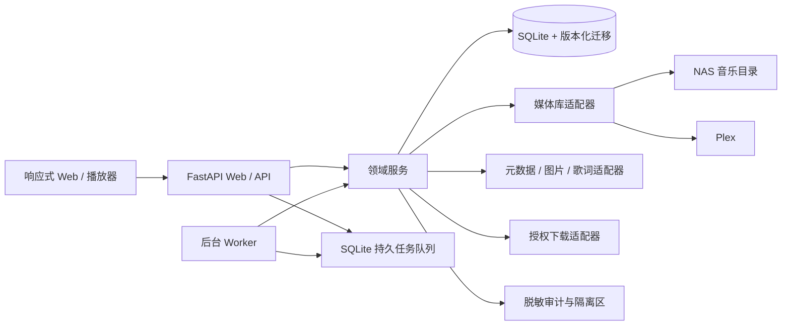
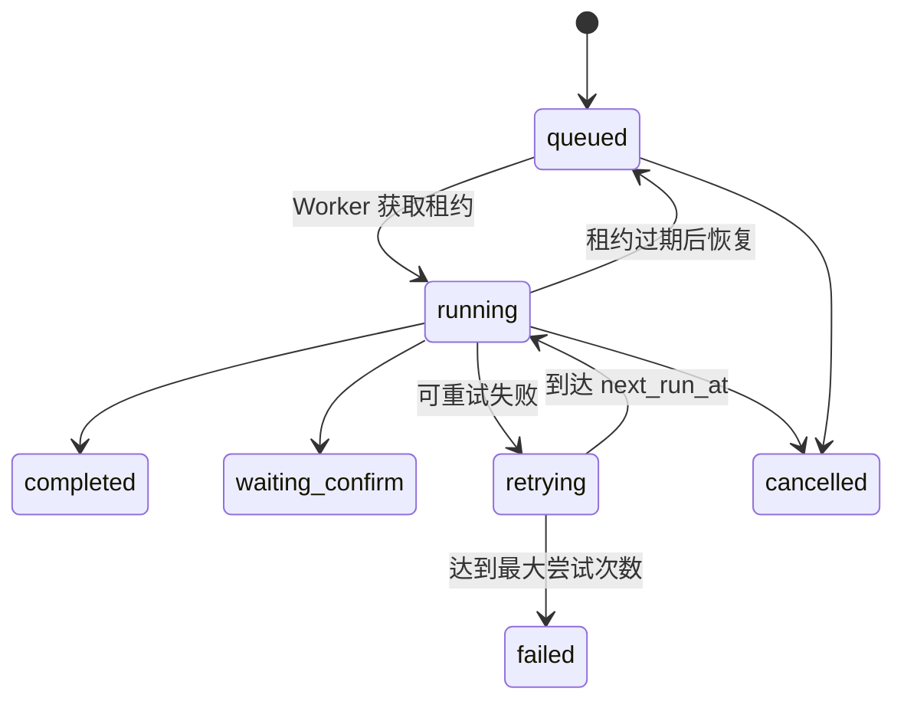

# 架构说明

SongLib Amp 采用模块化单体加独立 Worker。这个形态保留 NAS 部署的低运维成本，同时把协议、领域逻辑和外部服务隔离开，后续可按模块拆分。

## 模块

- `main.py`：应用装配 —— 创建 app、注册中间件、`include_router`、挂载静态资源。
- `routers/`：按用户任务域划分的 `APIRouter`。已拆出 `health`、`accounts`、
  `insights`、`backups`；其余路由仍在 `main.py`，见
  [docs/UI-REFACTOR.md](UI-REFACTOR.md) 里的迁移顺序。
- `schemas.py`：请求体模型。
- `auth.py` / `security.py`：首装、账号、角色、会话、CSRF、来源校验、速率限制和响应安全头。
- `adapters.py`：媒体库、元数据和授权下载提供方的稳定接口。
- `local_library.py` / `plex.py`：首批媒体后端实现。
- `playlists.py`：歌单顺序、M3U 路径映射、幂等更新与未匹配报告。
- `playlist_migration.py`：QQ 音乐/网易云音乐公开分享链接解析、严格曲目匹配、迁移预览与 Plex 输出。
- `fnos_music.py`：飞牛音乐 API 签名、曲目检索与歌单写入；令牌只从 NAS 环境变量读取。
- `download_inbox.py`：独立下载挂载扫描、Unicode 规范化、冲突预览、正式曲库入库与回滚记录。
- `recommendations.py`：本地播放事件、可解释画像、版本过滤、熟悉/探索平衡和候选池。
- `jobs.py` / `worker.py`：租约、检查点、指数退避、取消和失败恢复。
- `migrations.py` / `db.py`：向前迁移和兼容旧数据库。
- `audit.py`：敏感字段脱敏和管理操作留痕。

## 前端结构

前端按用户任务分目录，与本文档的"模块"一节按领域划分是同一个原则 ——
分组依据是用户要完成什么事，不是代码属于什么技术类型。

- `src/main.jsx`：入口。注册 Service Worker、挂载 React 根、广播启动事件。
- `src/app/`：应用装配。`App` 负责鉴权与首装分支，`AuthenticatedShell` 负责
  登录后的外壳、路由分发与主题。
- `src/features/`：按一级导航分组（见 [UX-RESTRUCTURE.md](UX-RESTRUCTURE.md)）。
  `player` 持有播放核心 context，其余 feature 消费它。
- `src/components/` / `src/hooks/` / `src/lib/`：跨 feature 复用的展示组件、
  hook 与纯函数。纯函数不依赖 React，可直接在 Node 测试里引入。
- `src/styles/`：设计系统。`tokens.css` 是颜色、字号、间距的唯一来源；
  优先级由 `index.css` 声明的 `@layer` 顺序决定。约束见
  [UI-REFACTOR.md](UI-REFACTOR.md)。

`legacy.*` 层是重构前遗留的样式，正在逐块迁移到 token，不要往里加新规则。

## 任务状态

任务进度写入数据库检查点。Worker 在执行期间续租；崩溃或 NAS 重启后，过期租约回到可领取状态。对文件产生副作用的处理器还必须使用目标存在检查或业务幂等键。

## 数据与隐私

完整播放事件只写本地 `listening_events`。推荐画像保存聚合偏好，不要求把历史上传第三方。外部目录提供方只接收完成当前搜索所需的最小查询；敏感凭据以 `secret_ref` 或本地加密/权限保护配置引用，API 不返回原值。

## 适配器扩展

新增后端时实现对应 Protocol，并在注册表登记能力。路径差异由 `path_mappings` 处理，不把某台 NAS 的绝对路径写进代码。适配器返回统一 Track Identity，匹配阶段严格校验歌曲名、主要艺人、专辑和时长，并过滤 Live、DJ、Remix、伴奏和翻唱等不同版本。
