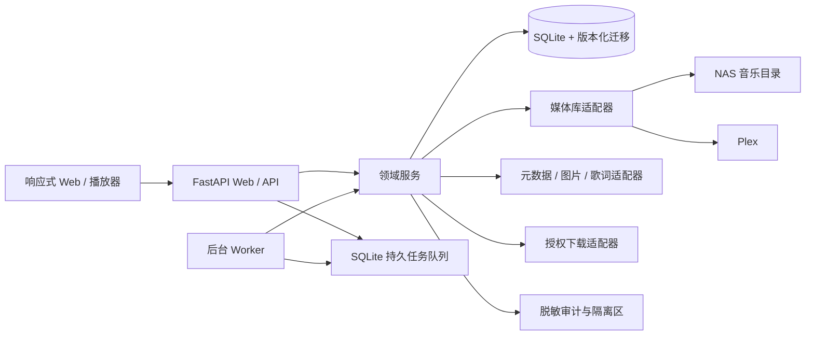
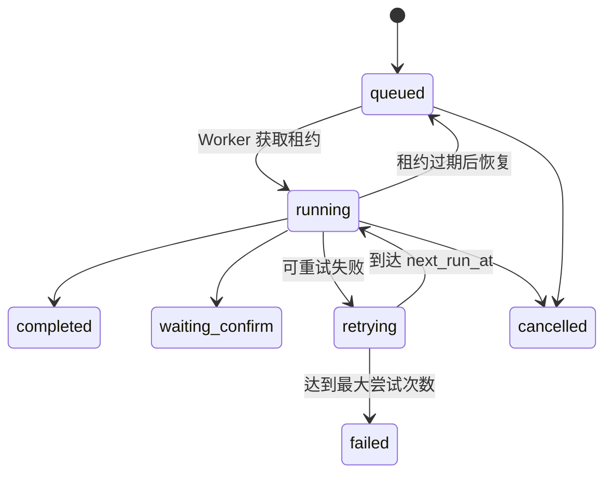

# 架构说明

SongLib Amp 采用模块化单体加独立 Worker。这个形态保留 NAS 部署的低运维成本，同时把协议、领域逻辑和外部服务隔离开，后续可按模块拆分。

## 模块

- `main.py`：HTTP contract、鉴权依赖、健康探针。
- `auth.py` / `security.py`：首装、账号、角色、会话、CSRF、来源校验、速率限制和响应安全头。
- `adapters.py`：媒体库、元数据和授权下载提供方的稳定接口。
- `local_library.py` / `plex.py`：首批媒体后端实现。
- `playlists.py`：歌单顺序、M3U 路径映射、幂等更新与未匹配报告。
- `recommendations.py`：本地播放事件、可解释画像、版本过滤、熟悉/探索平衡和候选池。
- `jobs.py` / `worker.py`：租约、检查点、指数退避、取消和失败恢复。
- `migrations.py` / `db.py`：向前迁移和兼容旧数据库。
- `audit.py`：敏感字段脱敏和管理操作留痕。

## 任务状态

任务进度写入数据库检查点。Worker 在执行期间续租；崩溃或 NAS 重启后，过期租约回到可领取状态。对文件产生副作用的处理器还必须使用目标存在检查或业务幂等键。

## 数据与隐私

完整播放事件只写本地 `listening_events`。推荐画像保存聚合偏好，不要求把历史上传第三方。外部目录提供方只接收完成当前搜索所需的最小查询；敏感凭据以 `secret_ref` 或本地加密/权限保护配置引用，API 不返回原值。

## 适配器扩展

新增后端时实现对应 Protocol，并在注册表登记能力。路径差异由 `path_mappings` 处理，不把某台 NAS 的绝对路径写进代码。适配器返回统一 Track Identity，匹配阶段严格校验歌曲名、主要艺人、专辑和时长，并过滤 Live、DJ、Remix、伴奏和翻唱等不同版本。
